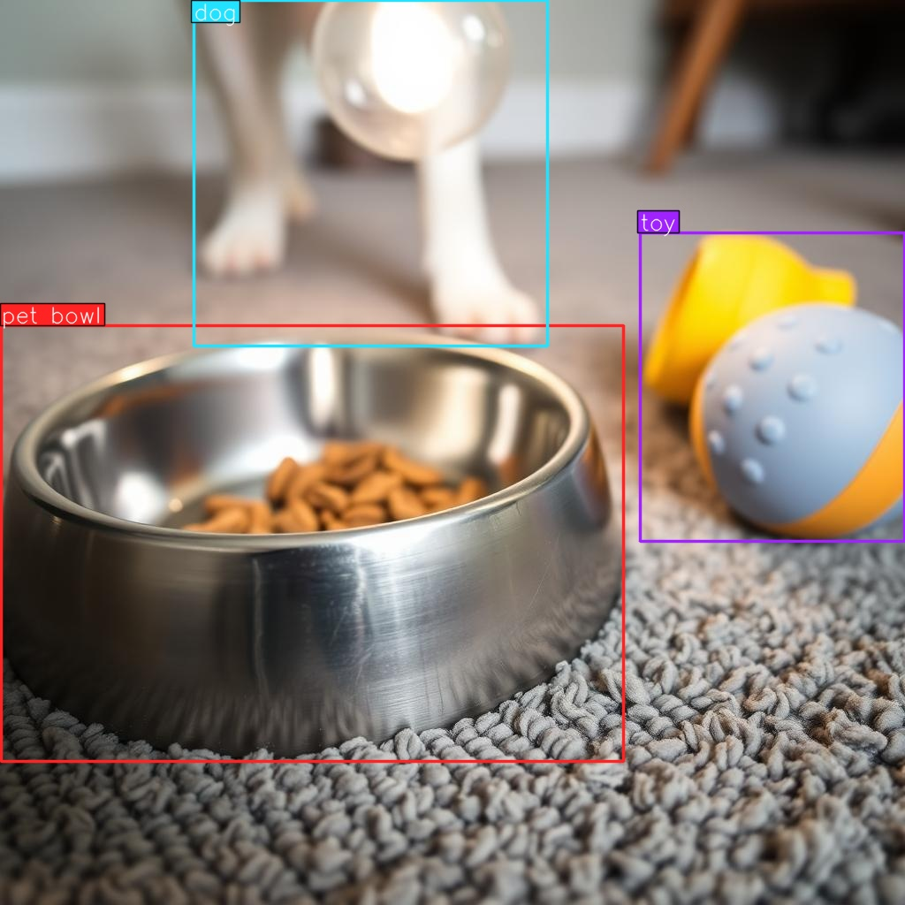
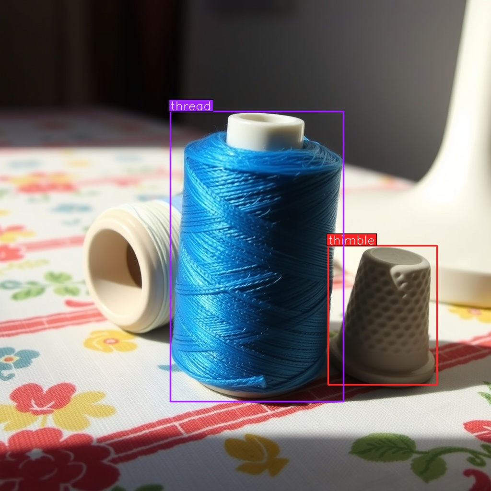

# SODA - Synthetic Object Detection Automation

| Prompt | Output Sample |
| :--- | :--- |
| **"A ground level shot of a pet feeding area on a carpet. A stainless steel pet food bowl is next to a rubber ball toy. Bowl has some dry food, daylight."** |  |
| **"Close up view of sewing essentials on a fabric tablecloth. A blue spool of thread with visible fiber texture sits next to a ceramic thimble. Hard shadow from lamp, loose thread strand, vintage vibe."** |  |

*Samples are generated and labeled with the default configuration.*

<br><br>

Generates multiple images and bounding box labels for desired objects from a text prompt. Orchestrates Flux for image generation and Grounding DINO for zeroshot auto labeling. Supports output formats of YOLO (txt), VOC (xml) and JSON without manual annotation.

Runs locally with a speed of **less than 10 seconds per image** on ~40 GB VRAM.

Can also be run on **~850 MB of VRAM** with trading-off the speed by about 8 times.

Integrated with **Replicate API**, so it is also possible to run it on the cloud with an API key.

---

## Core

I have used two models in general and also recommending them, however any model that is supported by [FluxPipeline](https://bfl.ai/blog/24-08-01-bfl) can be used as generator model by configuring `config.yaml`.

* **Generation:** FLUX.1-schnell (Black Forest Labs) | [Git](https://github.com/black-forest-labs/flux) | [HF](https://huggingface.co/black-forest-labs/FLUX.1-schnell)
* **Detection:** Grounding DINO (IDEA-Research) | [Git](https://github.com/IDEA-Research/GroundingDINO) | [HF](https://huggingface.co/IDEA-Research/grounding-dino-base/tree/main)

## Operation Modes

You can run the pipeline in two modes depending on hardware availability.

### 1. Local Mode
Runs models locally using HuggingFace Diffusers and Transformers. Requires an NVIDIA GPU. Supports **Multi-Object Detection**. Configurable memory sequencing for low-VRAM cards.

### 2. API Mode
Switchs the computation to an instance of Replicate. Can be run from anywhere.

* **Single-Class Detection only**. The Replicate API response structure lacks explicit label mapping for multi-object queries. To ensure integrity, this mode enforces a single-class generation.
* **Cost:** Usage is billed per second by the provider.

---

## Installation

**1. Clone the repository**
```bash
git clone https://github.com/senceryucel/soda.git
cd soda
```

**2. Install dependencies**

**NOTE**: `python<=3.13` is required. Everything was run and tested with `python=3.12.9`.

```bash
pip install -r requirements.txt
```

**3. Huggingface Login**

If you haven't already, you need to log in to huggingface and add your token. You can create a token from [here](https://huggingface.co/settings/tokens). 

```bash
hf auth login
```


**4. API Setup**

Only required if using API mode.

```bash
export REPLICATE_API_TOKEN=r8_your_token_here
```

---

## Configuration

All settings are managed in `config.yaml`.

### Wildcards (Regex)
Generate variations from a single prompt entry using `{option1|option2}` syntax (images are already varying with seeding, this can be used to increase scenery variation).

```yaml
generation:
  # randomly picks one texture and one location per image
  prompt: "a {rusty|chrome} tool lying on {wooden table|concrete floor}"
```

### Detection Settings

**Local Mode (Multi-Object):** 

Use dot separation.

```yaml
detection:
  prompt: "helmet . vest"
  class_map:
    "helmet": 0
    "vest": 1
```

**API Mode (Single-Object):** 

Single string required.

```yaml
detection:
  prompt: "helmet"
  class_map:
    "helmet": 0
```

---

## Performance

End-to-end pipeline time (generation + detection) per image.

| Hardware | VRAM | Computation | Time / Image |
| :--- | :--- | :--- | :--- |
| **NVIDIA A40** | 48GB | Default (Parallel) | **6.1 sec** |
| **NVIDIA GTX 1650** | 4GB | Sequencing | **67.0 sec** |

Sequencing mode offloads models to CPU when idle to fit within 850MB VRAM.

---

## Output Formats

Configurable via the `output` section in config.
* **YOLO:** Normalized .txt files
* **VOC:** Pascal .xml files
* **JSON:** COCO annotation format


